# Skeeper Reference Guide

Comprehensive reference for the `skeeper` CLI: a Go binary that mirrors spec artifacts into a sidecar Git repository with a tracked lockfile, so a main repository's PR diffs stay focused on code and every commit can prove which spec state shipped with it.

## What Is Skeeper

- **Lockfile-backed reliability.** `skeeper.lock` is committed to the main repo and pins each main commit to exact sidecar commits per namespace, with content digests, file counts, and byte counts.
- **Strict managed hooks.** `pre-commit` and `pre-merge-commit` mirror staged content, push the sidecar, write `skeeper.lock`, and stage it before Git creates the main commit. `pre-push` re-verifies the lock against the sidecar remote.
- **Namespaces in shared sidecars.** Many projects can share one sidecar Git remote without colliding because each project owns a namespace prefix and uses branch-aware refs of the form `<namespace>/__branches__/<source-branch>`.
- **Single-binary, local-first.** Skeeper shells out to `git` (and `gh` only when `skeeper init` creates a brand-new sidecar repo). Every operation is debuggable with the same Git commands you already know.

## Mental Model: Four Invariants

1. **`skeeper.lock` is the source of truth.** It records sidecar URL, source branch, namespace branch, sidecar commit SHA, content digest, file count, and byte count. Hydrate, verify, and fsck all read from it. Never edit SHAs by hand.
2. **Sync happens before the main commit, not after.** Failure fails the commit. There is no async retry queue.
3. **Failure fails closed unless you opt out.** `SKEEPER_SKIP=1` allows a single bypass that is recorded to `.git/skeeper/bypass.json` and surfaced in `status`, `fsck`, and `pre-push` until cleared by `skeeper sync`. `git commit --no-verify` is unsupported because Git skips all hook code.
4. **`pre-push` re-verifies before the remote sees the commit.** A bypassed or stale lock blocks the push.

```mermaid
flowchart LR
    A[git commit] --> B[existing user hook content]
    B --> C[skeeper pre-commit block]
    C --> D[reconcile staged specs and ownership]
    D --> E[fetch and rebase sidecar branch]
    E --> F[mirror namespace files into .skeeper/]
    F --> G[commit and push sidecar]
    G --> H[write and stage skeeper.lock]
    H --> I[main commit proceeds]
    I --> J[git push]
    J --> K[skeeper pre-push verify]
```



## Quick Start

```bash
# Inside any Git repository
skeeper init                # interactive: pick sidecar mode, namespace, patterns
skeeper hooks install       # one-time per clone
$EDITOR src/auth/SPEC.md
git add src/auth/service.go src/auth/SPEC.md
git commit -m "auth: design OAuth provider flow"
# the hook syncs the sidecar and stages skeeper.lock; commit it normally
git push
```

If the working tree already contains specs that should be sidecar-managed, run `skeeper adopt <glob>` after `init` to migrate them in one transaction.

## Command Map

| Command                             | Purpose                                                                                      | Read-only?         |
| ----------------------------------- | -------------------------------------------------------------------------------------------- | ------------------ |
| `skeeper init`                      | Interactively bootstrap `.skeeper.yml`, the sidecar repo, and the managed `.gitignore` block | no                 |
| `skeeper hydrate`                   | Restore spec files from the sidecar commits recorded in `skeeper.lock`                       | yes (writes specs) |
| `skeeper sync`                      | Mirror current specs to the sidecar and stage `skeeper.lock`                                 | no                 |
| `skeeper adopt <path-or-glob>...`   | Move main-tracked specs under sidecar coverage                                               | no                 |
| `skeeper untrack <path-or-glob>...` | Reverse adoption: stop tracking specs in the main repo                                       | no                 |
| `skeeper pattern test <glob>`       | Preview which working-tree files a glob would match                                          | yes                |
| `skeeper pattern add <glob>`        | Add a glob to a namespace and update `.skeeper.yml` and `.gitignore`                         | no                 |
| `skeeper status`                    | Show sidecar URL, branch, lock state, namespace digests, repair, bypass                      | yes                |
| `skeeper log <path>`                | Show sidecar history for a single spec file (default: locked commit; `--latest` reads tip)   | yes                |
| `skeeper fsck`                      | Compare working-tree specs against `skeeper.lock`                                            | yes                |
| `skeeper verify`                    | Validate `skeeper.lock` against the sidecar remote                                           | yes                |
| `skeeper hooks install`             | Install or refresh the strict hooks, `.gitattributes`, and merge driver                      | no                 |
| `skeeper hooks check`               | Validate that managed hook blocks and the merge driver are wired correctly                   | yes                |
| `skeeper merge-driver`              | Regenerate `skeeper.lock` during Git merges (called by `.gitattributes`)                     | no                 |
| `skeeper repair status`             | Show the active transaction and any pending bypass                                           | yes                |
| `skeeper repair resume`             | Re-run the recorded plan after a transient failure                                           | no                 |
| `skeeper repair abort`              | Clear the transaction (only safe before main-index mutation)                                 | no                 |
| `skeeper version`                   | Print build metadata                                                                         | yes                |

`--json` produces deterministic machine-readable output on every command marked above. `--dry-run` is supported on every mutating command. `--force` overrides the broad-plan guardrails declared under `settings.guardrails`.

For full per-flag detail, read `references/cli-reference.md`.

## Configuration Cheatsheet

`.skeeper.yml` lives at the repository root and is committed. The minimum required shape:

```yaml
sidecar: git@github.com:user/myproject-specs.git

namespaces:
  - name: project
    patterns:
      - "**/SPEC.md"
      - "docs/specs/**"
      - ".claude/plans/**"
      - "**/*.spec.md"
    exclude:
      - "docs/specs/private/**"
```

Optional operational defaults:

```yaml
settings:
  guardrails:
    max_files: 100 # default 100
    max_bytes: 10485760 # default 10 MiB
  hooks:
    pre_push_timeout: 30s # default 30s
    allow_skip_env: SKEEPER_SKIP # default SKEEPER_SKIP
```

Four rules to know:

1. **Unknown keys are rejected.** Decode is strict.
2. **`exclude` is the only public exclusion mechanism.** Negative globs (`!docs/private/**`) inside `patterns` are rejected.
3. **Ownership must be unique.** If two namespaces match the same file, the plan fails with a request to add an `exclude`.
4. **`__branches__` is reserved.** It is the segment that separates a namespace from its branch-aware refs.

For the full schema with every field and default, read `references/config-reference.md`.

## Common Workflows

### Bootstrap a new repository

```bash
skeeper init \
  --sidecar-name myproject-specs \
  --visibility private \
  --namespace project \
  --patterns "**/SPEC.md" \
  --patterns "docs/specs/**"
skeeper hooks install
git add .skeeper.yml .gitignore
git commit -m "chore: bootstrap skeeper"
```

### Join a repo with an existing sidecar

```bash
skeeper init --sidecar git@github.com:user/shared-specs.git \
  --namespace project \
  --patterns "**/SPEC.md"
skeeper hooks install
skeeper hydrate
```

### Adopt files already in the main repo

```bash
skeeper pattern test "docs/adrs/**"          # confirm matches
skeeper adopt --dry-run "docs/adrs/**"        # preview move
skeeper adopt "docs/adrs/**"                  # execute
git commit -m "chore: adopt ADRs into sidecar"
```

### Recover after a failed push

```bash
skeeper repair status
# transaction: <id> (<phase>)
# fix the underlying network/auth/contention issue, then:
skeeper repair resume
# or, only before main-index mutation:
skeeper repair abort
```

### Resolve a `skeeper.lock` merge conflict

```bash
git merge feature/auth-redesign
# .gitattributes routes lock conflicts through skeeper merge-driver automatically
# if you resolved by hand:
skeeper sync
git add skeeper.lock
git commit
```

## CI Integration

Same-repository GitHub Action wraps the released binary:

```yaml
name: skeeper

on:
  pull_request:
  push:
    branches: [main]

jobs:
  verify:
    runs-on: ubuntu-latest
    steps:
      - uses: actions/checkout@v4
        with:
          fetch-depth: 0
      - uses: compozy/skeeper@v0.2.0
        with:
          args: |
            verify
            --json
          ssh-private-key: ${{ secrets.SKEEPER_SSH_PRIVATE_KEY }}
```

Credential precedence:

1. `ssh-private-key` writes a temp key and sets `GIT_SSH_COMMAND`. The key is wiped on cleanup.
2. `token` configures HTTPS GitHub credentials in a per-job `GIT_CONFIG_GLOBAL`.
3. The runner's existing Git/SSH config is used when neither input is provided.

Secrets are always masked through `::add-mask::` before configuration.

## When NOT To Use Skeeper

- **Repos that already version specs in the main tree** and want them to appear in PR diffs alongside code. Skeeper exists to keep specs out of those diffs.
- **Teams that need PR review on the spec content itself before merge.** Skeeper mirrors after the main commit succeeds, so spec review must happen against the sidecar repo or against the main-tree working copy before commit.
- **Repos without a stable sidecar host.** Skeeper requires a Git remote that the working tree can reach during commit; an unreachable remote means every commit fails closed unless someone uses `SKEEPER_SKIP=1`.
- **Storing build artifacts, generated code, or large binaries.** Skeeper is for spec-shaped text artifacts. Guardrails default to 100 files and 10 MiB per plan precisely to keep it that way.

## Anti-Patterns for Agents

1. **Never use `git commit --no-verify` on a skeeper-enabled repo.** Use `SKEEPER_SKIP=1` instead so the bypass is audited.
2. **Never edit SHAs in `skeeper.lock` by hand.** Use `skeeper sync` or `skeeper merge-driver` to regenerate.
3. **Never reuse a sidecar remote across projects without unique namespaces.** Skeeper requires unambiguous routing; ownership must be unique per file.
4. **Never run `skeeper repair abort` after the main index has been mutated.** Use `skeeper repair resume` instead, or fix the sidecar manually if the sidecar has already received the push.
5. **Never bypass with `SKEEPER_SKIP=1` and forget to run `skeeper sync` afterward.** The bypass keeps surfacing in `status`, `fsck`, and `pre-push` until cleared.
6. **Never put negative globs in `patterns`.** Use `exclude` instead; the loader rejects negative globs explicitly.
7. **Never delete `skeeper.lock` to "fix" a merge conflict.** Resolve it via the merge driver, then run `skeeper verify`.
8. **Never assume `skeeper hydrate` chases the latest tip.** It restores from the locked commits; `--latest` only exists on `skeeper log`.

## References

- `references/cli-reference.md` — every command, every flag, every JSON schema.
- `references/config-reference.md` — full `.skeeper.yml` schema, defaults, and validation rules.
