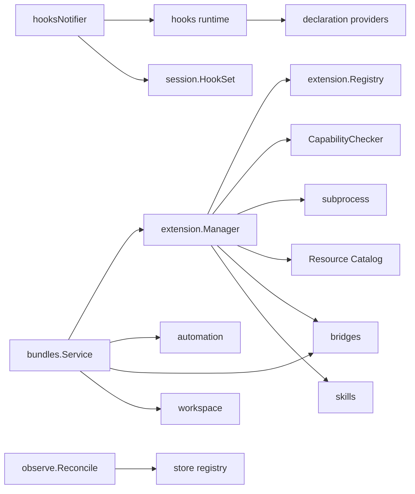

# Refactoring Analysis: AGH Extensibility Platform

> **Date**: 2026-04-15
> **Scope**: `internal/extension`, `internal/hooks`, `internal/daemon/hooks_bridge.go`, `internal/session/hooks.go`, and bundle/runtime reconciliation seams related to extensibility
> **Analyzed by**: AI-assisted refactoring analysis (Martin Fowler's catalog)
> **Language/Stack**: Go, single-binary daemon architecture
> **Test Coverage**: Known — the target area has focused unit/integration tests (`manager_test.go`, `service_test.go`, hook/API tests), but no shared end-to-end contract test for a generic resource runtime

---

## Executive Summary

The main extensibility problem is not one missing hook or one missing tool surface. The root cause is that the platform model is fragmented across string-based registries, domain-specific reconcile loops, and hand-maintained bridge code. That fragmentation makes every new extension surface a shotgun-surgery change across manifest parsing, protocol constants, capability policy, runtime negotiation, and daemon wiring.

The highest-impact refactoring is to introduce a single extensibility metadata model and a shared resource runtime for extension-owned resources. Without that, wiring `tool.*`, `permission.*`, and `provide_tools` will fix symptoms but preserve the structural reason this area keeps reopening.

| Severity         | Count |
| ---------------- | ----- |
| 🔴 Critical (P0) | 2     |
| 🟠 High (P1)     | 2     |
| 🟡 Medium (P2)   | 0     |
| 🔵 Low (P3)      | 0     |
| **Total**        | **4** |

### Top Opportunities (Quick Wins + High Impact)

| #   | Finding                                                                 | Location                                                                                                                                                      | Effort      | Impact                                                        |
| --- | ----------------------------------------------------------------------- | ------------------------------------------------------------------------------------------------------------------------------------------------------------- | ----------- | ------------------------------------------------------------- |
| 1   | Replace scattered extension-surface metadata with one canonical model   | `internal/extension/manifest.go:37`, `internal/extension/protocol/host_api.go:8`, `internal/extension/capability.go:17`, `internal/extension/manager.go:1974` | significant | Removes the root cause of repeated contract drift             |
| 2   | Split `extension.Manager` into control-plane components                 | `internal/extension/manager.go:191`                                                                                                                           | significant | Reduces divergent change and concentrates lifecycle ownership |
| 3   | Replace hand-maintained hook bridge matrix with taxonomy-driven binding | `internal/daemon/hooks_bridge.go:194`, `internal/session/hooks.go:9`                                                                                          | moderate    | Prevents hook taxonomy drift and closes missing surfaces      |
| 4   | Unify reconcile/snapshot mechanics behind a shared resource runtime     | `internal/hooks/hooks.go:256`, `internal/bundles/service.go:448`, `internal/observe/reconcile.go:16`                                                          | significant | Stops recreating ownership/reconcile logic per subsystem      |

---

## Findings

### P0 — Critical

#### F1: Scattered Extension Surface Metadata Causes Shotgun Surgery

- **Smell**: Shotgun Surgery, Primitive Obsession
- **Category**: Change Preventer
- **Location**: `internal/extension/manifest.go:37-58`, `internal/extension/protocol/host_api.go:8-136`, `internal/extension/capability.go:17-70`, `internal/extension/manager.go:1974-1976`, `internal/subprocess/handshake.go:94-98`
- **Severity**: 🔴 Critical
- **Impact**: Adding or evolving a single extension surface requires synchronized edits across manifest resources, capability-service maps, Host API method lists, security maps, handshake flags, and runtime negotiation. This is the structural reason the same extensibility gaps reappear.

**Current Code** (simplified):

```go
type ResourcesConfig struct {
    Skills []string
    Agents []string
    Bundles []string
    Hooks []HookConfig
    MCPServers map[string]MCPServerConfig
}

var hostAPIMethodSecurityCapability = map[string]string{ ... }

func daemonRequestMethods() []string {
    return []string{"execute_hook", "health_check", "shutdown"}
}
```

**Recommended Refactoring**: Introduce Parameter Object + Extract Module

**After** (proposed):

```go
type SurfaceKind string

type SurfaceSpec struct {
    Kind            SurfaceKind
    ManifestField   string
    HostMethods     []HostAPIMethod
    ServiceMethods  []ExtensionServiceMethod
    SecurityCaps    []SecurityCapability
    NegotiatedFlags []NegotiatedFeature
}

type SurfaceCatalog interface {
    All() []SurfaceSpec
    ByKind(SurfaceKind) SurfaceSpec
}
```

**Rationale**: The current design stores one concept, “what an extension surface is”, in five disconnected representations. A canonical surface catalog lets manifest validation, capability checking, handshake negotiation, SDK generation, and daemon runtime derive from one source of truth.

---

#### F2: `extension.Manager` Is a Large Module with Divergent Change

- **Smell**: Large Class/Module, Divergent Change
- **Category**: Bloater
- **Location**: `internal/extension/manager.go:191-2231`
- **Severity**: 🔴 Critical
- **Impact**: The manager currently owns registry state, subprocess launch, protocol negotiation, health supervision, resource registration, bridge delivery, runtime status, and resource listing. Any new extensibility feature changes the same file, which raises coordination cost and makes safe evolution harder.

**Current Code** (simplified):

```go
type Manager struct {
    registry   *Registry
    capChecker *CapabilityChecker
    launch     processLauncher
    hostMethods map[string]subprocess.HandlerFunc
    extensions map[string]*managedExtension
}

func (m *Manager) Start(ctx context.Context) error
func (m *Manager) Stop(ctx context.Context) error
func (m *Manager) Reload(ctx context.Context) error
func (m *Manager) DeliverBridge(ctx context.Context, ...) ...
func (m *Manager) HookDeclarations(ctx context.Context) ...
func (m *Manager) MCPServers() ...
```

**Recommended Refactoring**: Extract Class / Extract Module

**After** (proposed):

```go
type Supervisor struct { ... }      // process lifecycle + health
type Catalog struct { ... }         // hooks/tools/agents/mcps/bundles
type Negotiator struct { ... }      // handshake + capability grants
type Runtime struct {
    supervisor *Supervisor
    catalog    *Catalog
    negotiator *Negotiator
}
```

**Rationale**: The manager is doing control-plane work, resource-catalog work, and transport work at the same time. Splitting these responsibilities is prerequisite to any definitive extensibility design, especially if the platform adopts a shared resource runtime.

---

### P1 — High

#### F3: Hook Bridge Uses a Hand-Maintained Adapter Matrix

- **Smell**: Duplicated Code, Shotgun Surgery
- **Category**: DRY Violation
- **Location**: `internal/daemon/hooks_bridge.go:194-317`, `internal/session/hooks.go:9-112`
- **Severity**: 🟠 High
- **Impact**: The hook bridge repeats one forwarding method per event family, while `session.HookSet` hardcodes the available domains. When the taxonomy grows, the adapter layer must be manually updated in multiple places, which is exactly how `tool.*` and `permission.*` fell out of the runtime surface.

**Current Code** (simplified):

```go
type HookSet struct {
    Session SessionLifecycleHooks
    Prompt  PromptHooks
    Events  EventHooks
    Agent   AgentHooks
    Conversation ConversationHooks
    Compaction   CompactionHooks
}

func (n *hooksNotifier) DispatchSessionPreCreate(...) ...
func (n *hooksNotifier) DispatchSessionPostCreate(...) ...
func (n *hooksNotifier) DispatchPromptPostAssemble(...) ...
```

**Recommended Refactoring**: Extract Module + Replace Repeated Boilerplate with Taxonomy-Driven Binding

**After** (proposed):

```go
type HookSurface interface {
    Dispatch(ctx context.Context, event hooks.HookEvent, payload any) (any, error)
}

type SessionHookBinding struct {
    SupportedFamilies []hooks.HookEventFamily
    Surface           HookSurface
}
```

**Rationale**: The hook taxonomy already exists in one place. The daemon/session bridge should derive its supported binding surface from that taxonomy instead of encoding a second hand-maintained matrix. This is the most direct root-cause fix for missing hook families.

---

#### F4: Reconcile and Snapshot Logic Is Reimplemented Per Domain

- **Smell**: Duplicated Code, Divergent Change
- **Category**: Change Preventer
- **Location**: `internal/hooks/hooks.go:256-339`, `internal/bundles/service.go:448-572`, `internal/observe/reconcile.go:16-89`
- **Severity**: 🟠 High
- **Impact**: Hooks, bundles, and observer state all implement their own flavor of “collect current inputs -> resolve desired state -> swap/update persisted state”. The duplicated lifecycle pattern is already expensive, and it blocks a unified extensibility model because each domain keeps inventing its own ownership and reload semantics.

**Current Code** (simplified):

```go
func (h *Hooks) Rebuild(ctx context.Context) error { ... }

func (s *Service) Reconcile(ctx context.Context) error {
    activations, _ := s.store.ListBundleActivations(ctx)
    desiredJobs := ...
    desiredBridges := ...
    s.automation.SyncManagedDefinitions(...)
    s.bridges.SyncManagedInstances(...)
}

func (o *Observer) Reconcile(ctx context.Context) (...) { ... }
```

**Recommended Refactoring**: Extract Module

**After** (proposed):

```go
type ResourceRuntime interface {
    Snapshot(ctx context.Context) ([]ResourceRecord, error)
    Reconcile(ctx context.Context, records []ResourceRecord) error
}

type ResourceOwner interface {
    Kind() ResourceKind
    Resolve(ctx context.Context) ([]ResourceRecord, error)
}
```

**Rationale**: A shared resource runtime is the structural answer to repeated domain-specific reconcile code. Even if the first cut only serves extension-owned resources, this extraction prevents another round of ad hoc runtime logic in each subsystem.

---

## Coupling Analysis

### Module Dependency Map



### High-Risk Coupling

| Module               | Afferent (dependents) | Efferent (dependencies)                                                              | Risk   |
| -------------------- | --------------------- | ------------------------------------------------------------------------------------ | ------ |
| `internal/hooks`     | 59 importers          | internal package-local runtime plus dispatcher dependencies                          | high   |
| `internal/extension` | 20 importers          | 7 internal package dependencies plus subprocess protocol and skills/hook integration | high   |
| `internal/bundles`   | 5 importers           | 6 internal package dependencies including extension, automation, bridges, workspace  | medium |

### Circular Dependencies

None detected in the analyzed package graph.

---

## DRY Analysis

### Duplicated Code Clusters

| Cluster                                                   | Locations                                                                                                                                                                    | Lines | Extraction Strategy                                               |
| --------------------------------------------------------- | ---------------------------------------------------------------------------------------------------------------------------------------------------------------------------- | ----- | ----------------------------------------------------------------- |
| Hook forwarding boilerplate per event family              | `internal/daemon/hooks_bridge.go:194-317`, `internal/session/hooks.go:9-112`                                                                                                 | ~180  | Generate bindings from taxonomy or use a unified dispatch surface |
| Reconcile/snapshot lifecycle reimplemented by domain      | `internal/hooks/hooks.go:256-339`, `internal/bundles/service.go:448-572`, `internal/observe/reconcile.go:16-89`                                                              | ~280  | Extract shared resource runtime/reconcile substrate               |
| Extension surface metadata encoded in multiple registries | `internal/extension/manifest.go:37-58`, `internal/extension/protocol/host_api.go:8-136`, `internal/extension/capability.go:17-70`, `internal/extension/manager.go:1974-1976` | ~210  | Centralize in one extensibility surface catalog                   |

### Magic Values

| Value                                            | Occurrences | Suggested Constant Name                                | Files                                                        |
| ------------------------------------------------ | ----------- | ------------------------------------------------------ | ------------------------------------------------------------ |
| `"execute_hook"`, `"health_check"`, `"shutdown"` | multiple    | `NegotiatedDaemonMethods`                              | `internal/extension/manager.go`, SDK harness/tests           |
| `"memory.backend"`, `"bridge.adapter"`           | multiple    | `SurfaceKindMemoryBackend`, `SurfaceKindBridgeAdapter` | `internal/extension/protocol/host_api.go`, manifest handling |

### Repeated Patterns

The main repeated pattern is string-based extensibility metadata. Resource kinds, capability names, Host API methods, and negotiated features are all represented as raw strings in separate files. This is not just a naming issue; it is duplicated knowledge that makes evolution error-prone.

---

## SOLID Analysis

> **Skipped**: This project does not use domain-driven design or a layered domain model where SOLID analysis would add meaningful signal. The analyzed area is infrastructure/control-plane code, so Fowler-style modularity and coupling analysis is the better fit here.

---

## Suggested Refactoring Order

Recommended sequence based on impact, effort, and dependency between refactorings:

### Phase 1: Define the canonical extensibility model

1. Introduce a unified `SurfaceCatalog` for extension-owned resources and negotiated features — `internal/extension/*`
2. Define the first-cut shared resource runtime API for extension-owned resources — new runtime package or extracted control-plane module

### Phase 2: Reshape the control plane around that model

1. Split `extension.Manager` into lifecycle supervision, negotiation, and catalog responsibilities — `internal/extension/manager.go`
2. Rebind hook/session integration through taxonomy-driven dispatch, not hand-maintained interfaces — `internal/daemon/hooks_bridge.go`, `internal/session/hooks.go`

### Phase 3: Move existing domain runtimes onto the common substrate

1. Move extension-provided tools onto the new resource runtime
2. Migrate bundle-managed runtime materialization to the shared ownership/reconcile model
3. Add other resource families only after the first cut is stable

### Prerequisites

- Preserve current tests around `internal/extension`, `internal/hooks`, and `internal/bundles` as regression coverage.
- Add contract tests for the new shared runtime before migrating multiple resource families onto it.
- Do not wire new surfaces directly into existing ad hoc maps once the shared catalog exists.

---

## Risks and Caveats

- `internal/hooks` has high afferent coupling; refactoring its public surface will have broad blast radius.
- `internal/bundles/service.go` contains operational logic that is already in production code paths for activation/reconcile; migration must preserve ownership rules.
- The current structure is not accidental. Some duplication exists because the platform evolved in stages. That history matters, but it no longer justifies keeping the metadata fragmented.
- A generic resource runtime should start with extension-owned resources, not the whole daemon, to avoid turning the refactor into a full platform rewrite.

---

## Appendix: Smell Distribution

| Category               | Count | %   |
| ---------------------- | ----- | --- |
| Bloaters               | 1     | 25% |
| Change Preventers      | 2     | 50% |
| Dispensables           | 0     | 0%  |
| Couplers               | 0     | 0%  |
| Conditional Complexity | 0     | 0%  |
| DRY Violations         | 1     | 25% |
